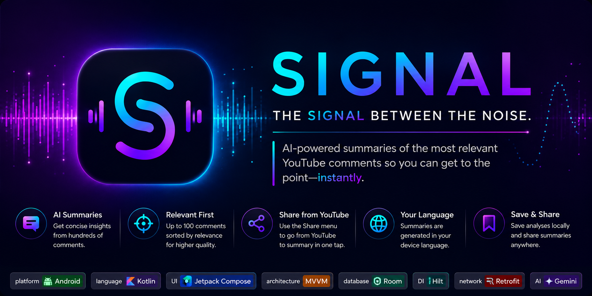
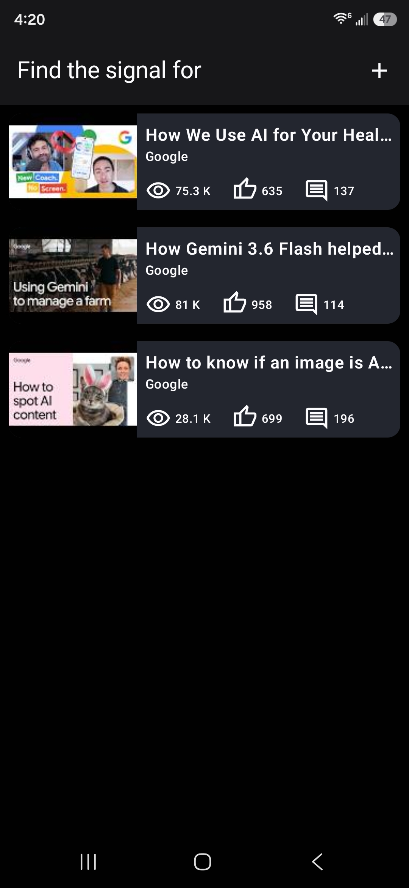
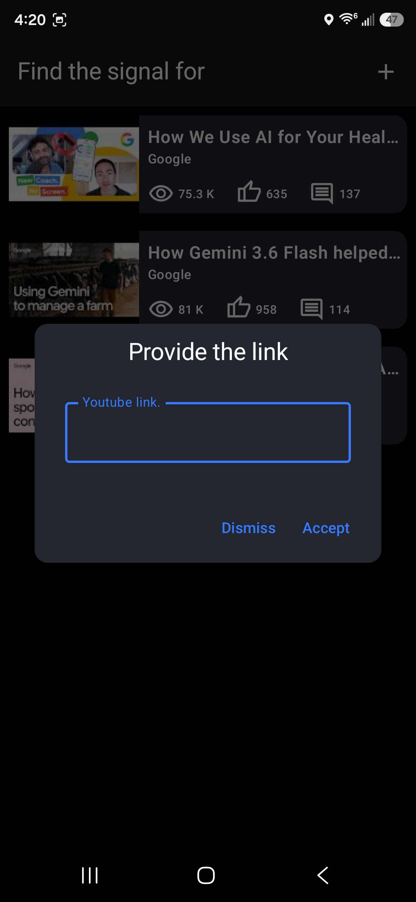
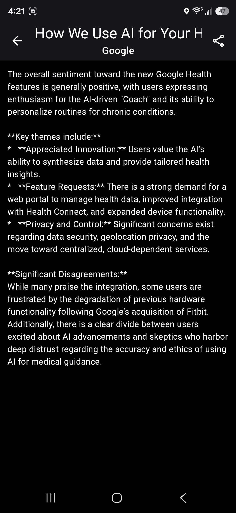

> *Every popular YouTube video tells two stories: the one in the video, and the one hidden in its comments. Signal helps you discover the second one.*

Signal is an Android application that uses Artificial Intelligence to summarize the most valuable opinions from YouTube comments.

Instead of reading hundreds or even thousands of comments, Signal analyzes the conversation and generates a concise summary that helps users quickly understand what people are actually saying.

---

# Why Signal?

Popular YouTube videos often receive an overwhelming number of comments. While many contain useful feedback, others are spam, jokes, off-topic discussions, or arguments that make it difficult to identify the information that truly matters.

Signal was created to separate the **signal** from the **noise**, allowing users to focus on the most relevant insights in just a few seconds.

The application is also useful for content creators who want to understand audience feedback without manually reading every comment.

---

# Features

- Analyze any public YouTube video.
- AI-powered summaries generated with Gemini.
- Retrieves up to **100 comments sorted by relevance**, prioritizing meaningful discussions over sheer quantity.
- Automatically generates summaries in the device's language.
- Saves every analysis locally for future reference.
- Share generated summaries with any compatible application.
- Seamless integration with Android's Share menu.
- Modern Material Design 3 interface built with Jetpack Compose.

---

# Why only 100 comments?

Rather than processing hundreds or even thousands of comments, Signal intentionally retrieves **up to 100 comments sorted by relevance**.

This approach allows the AI to focus on the most meaningful discussions while reducing unnecessary processing, lowering API usage, and delivering concise summaries without sacrificing quality.

In practice, the most relevant comments usually capture the overall opinion of the community remarkably well.

---

# Seamless YouTube Integration

Signal integrates directly with Android's Share menu, making the experience feel like a natural extension of YouTube.

Instead of copying and pasting a link manually:

1. Open a video in YouTube.
2. Tap **Share**.
3. Select **Signal**.

The application automatically retrieves the video information, analyzes its most relevant comments, and takes you directly to the generated summary.

---

# How it works

1. Share a YouTube video with Signal or paste its link manually.
2. Signal retrieves the video's information using the YouTube Data API.
3. Up to **100 comments sorted by relevance** are requested.
4. The comments are sent to Gemini using a predefined prompt.
5. Gemini generates a concise summary in the device's language.
6. The result is stored locally using Room.
7. The summary screen opens automatically, where the analysis can also be shared with other applications.

---

# Technologies

- Kotlin
- Jetpack Compose
- Material Design 3
- MVVM
- UDF (Unidirectional Data Flow)
- Kotlin Coroutines
- StateFlow
- Room
- Retrofit
- Hilt
- Coil
- YouTube Data API
- Gemini Interaction API

---

# Architecture

Signal follows **Google's Modern Android Development (MAD)** recommendations and implements a clean MVVM architecture with a unidirectional data flow.

```text
           UI
            │
            ▼
      ViewModel
            │
            ▼
       Repository
        ├── Room
        └── Remote APIs
```

---

# Screenshots

<p align="center">
  
  
  
</p>

---

# Getting Started

To build and run this project, you'll need your own API keys.

## Prerequisites

- Android Studio
- JDK 17 or newer
- YouTube Data API v3 key
- Gemini API key

## Setup

1. Clone this repository.
2. Create a `local.properties` file in the project's root directory.
3. Add your API keys:

```properties
YOUTUBE_API_KEY=YOUR_YOUTUBE_API_KEY
GEMINI_API_KEY=YOUR_GEMINI_API_KEY
```

1. Sync the project with Gradle.
2. Build and run the application.

> **Note**
>
> API keys are intentionally excluded from the repository for security reasons. Signal reads them from `local.properties` through `BuildConfig`.

---

# Roadmap

- Custom AI prompts.
- Multiple summary styles.
- Sentiment visualization.
- Keyword extraction.
- Improved sharing capabilities.
- Additional language enhancements.

---

# License

This project was created for educational and portfolio purposes.